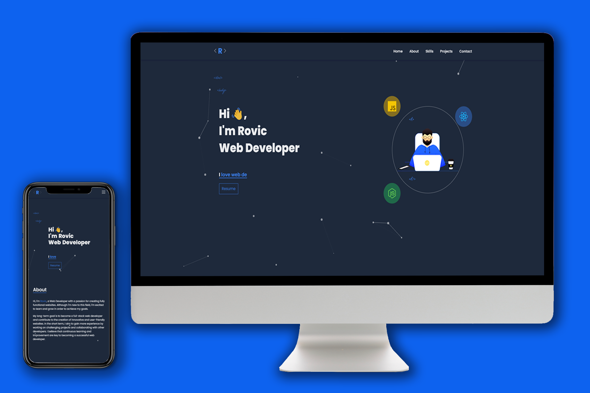

<!DOCTYPE html>
<html>
  <head>
   //
  </head>
  <body>
    
    <h1 style="font-size: 48px; margin-bottom: 24px;">👋 Welcome </h1>
    
This website was created using React and hosted on Vercel.

    <h2 style="font-size: 32px; margin-top: 48px;">✨ Features</h2>
    <ul style="font-size: 24px;">
      <li>Fully responsive design 📱💻</li>
      <li>Animated page transitions 🎬</li>
      <li>Interactive projects section 🖥️</li>
      <li>Contact form with email integration 📨</li>
    </ul>
    <h2 style="font-size: 32px; margin-top: 48px;">🛠️ Technologies Used</h2>
    <ul style="font-size: 24px;">
      <li>React</li>
      <li>TailWind</li>
       <li>Node.Js</li>
      <li>Vercel</li>
    </ul>
    <h2 style="font-size: 32px; margin-top: 48px;">🌐 View the Website</h2>
    
You can view the live website at: <a href="https://rovic.vercel.app/" style="color: #0070f3; text-decoration: none;">https://rovic.vercel.app/</a>

   
  
  </body>
</html>
